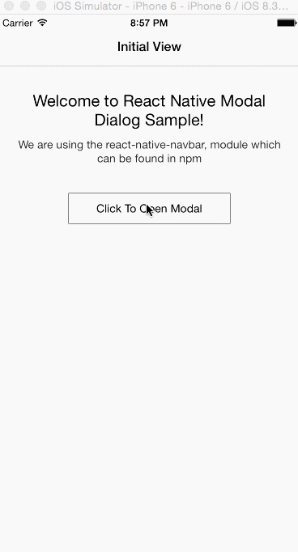

# React-Modal-Nav-Example 

Sample application showing how get the standard IOS modal dialog experience with React-Native. 

I did see an example in the [UIExplorer Application](https://github.com/facebook/react-native/blob/0bfcc9a6c266f1af0b1eeadc497551cdb4e1b93d/Examples/UIExplorer/Navigator/NavigationBarSample.js), but it seemed like alot of code for a pretty basic feature, setting up the seperate routing object and without additional documentation, the [Kureev/react-native-navbar](https://github.com/Kureev/react-native-navbar) module met my needs

